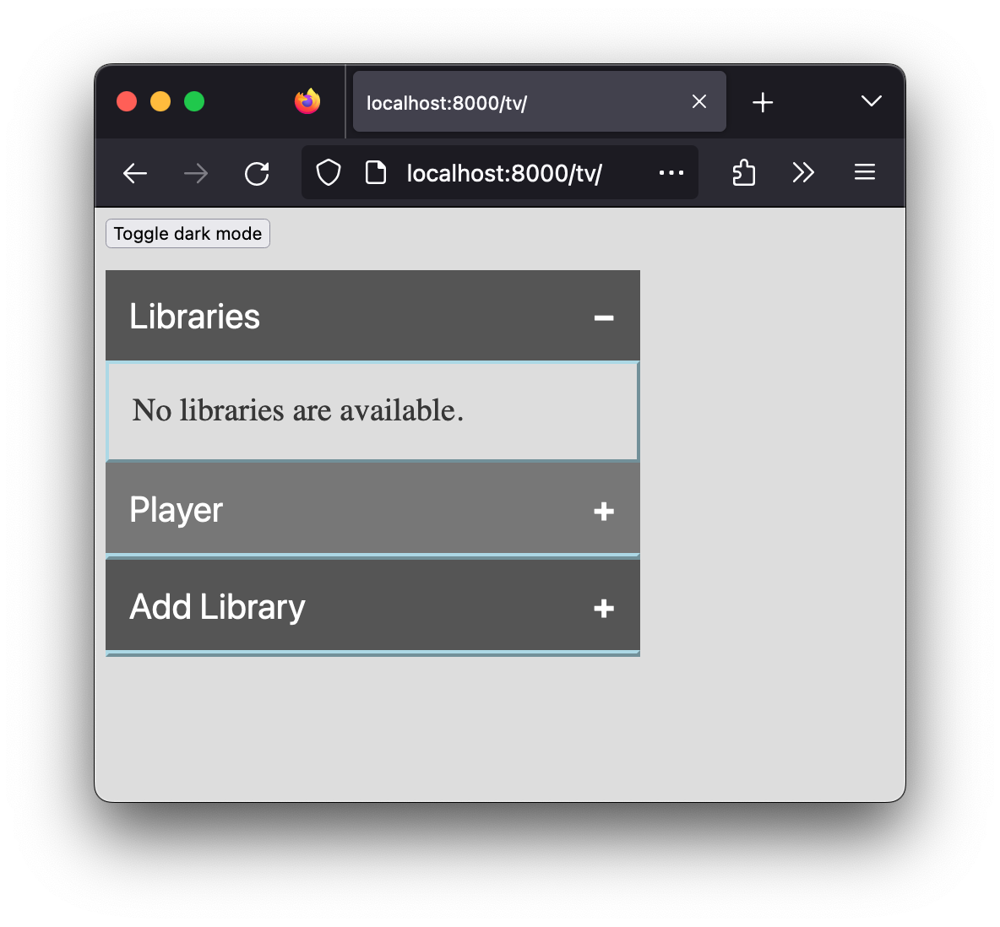
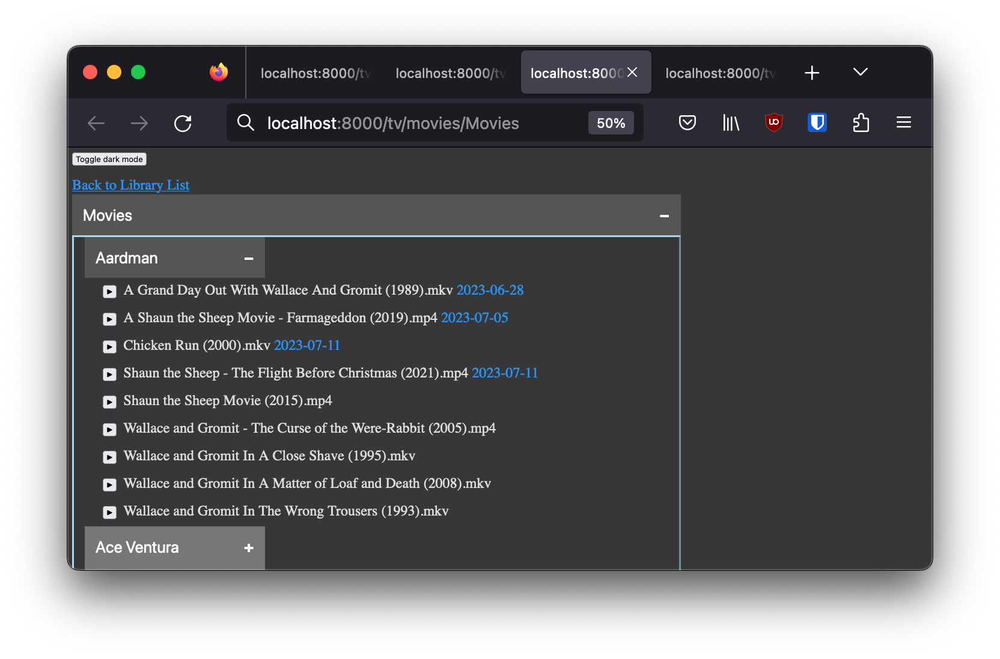
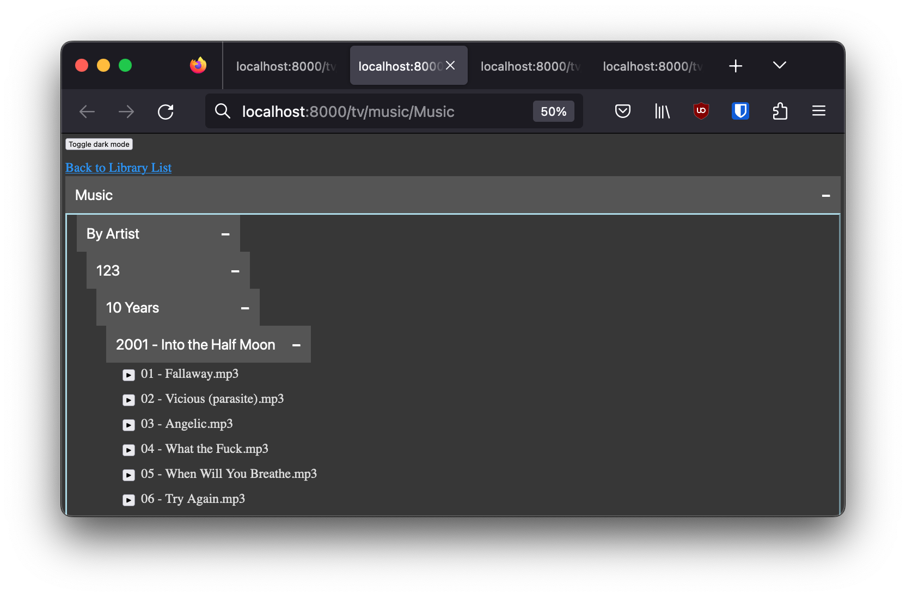
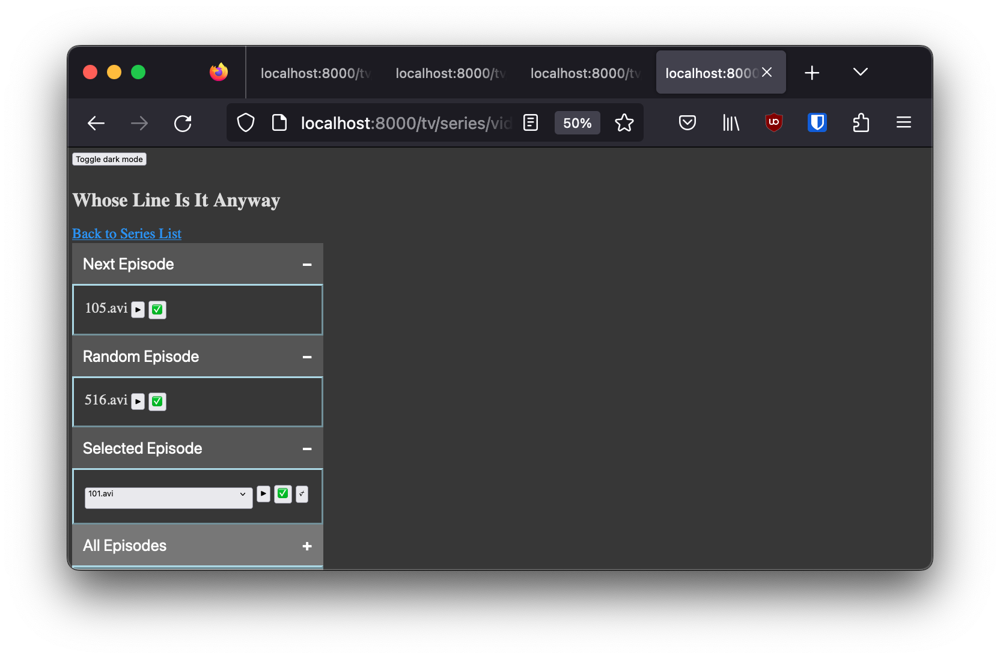

# smb_to_kodi
A Django-based web application to find media files shared via SMB and play them on a Kodi player using Kodi's built-in JSONRPC interface.

## Purpose
I created this project because [Kodi](https://kodi.tv/) is my preferred media player, but when you run it on an embedded system (like a Fire TV Stick), it can be difficult to add all of your sources through the Kodi UI and keep track of what things in your library have been watched. With this application, I can control Kodi completely from any desktop or mobile device on my private network, easily playing the next episode in a television series, a movie, or a song (with visualization!) without the need to navigate any UI with a limited remote control.

## Prerequisites
In order to use this application, you will need the following:

- A private network, like what you might find behind a NAT/router in a home. You'll be enabling features that are inherently insecure, so you should only use this application on a trusted network (at least for now).
- A Kodi player installed on a device somewhere on your private network, and configured to enable remote control.
  - You should enable HTTP-based control in Kodi under [Settings/Services/Control](https://kodi.wiki/view/Settings/Services/Control). You need not change the port, and at this time, authentication is not supported.
  - Once you have enabled remote control, you should be able to test access to Kodi using your hostname/IP address and your chosen port. From any browser on your private network, you can visit `http://<hostname|IP>:8080/jsonrpc`, and you should see a simple introspection interface. Once you can access that page, you'll be able to configure and use this application to play media in Kodi.
- A Samba/SMB server somewhere on your private network that contains the media you want to play in Kodi, and is configured to allow at least read-only access to your media share for an unauthenticated guest user.
  - The process for configuring a guest user like this is different depending on the server type, and is beyond the scope of this project and README, but as long as you can see the media files you want to play in Kodi over the network without a username and password, things will work as intended.
- A Docker runtime environment that can access both the Kodi endpoint and the SMB server over the network. This Docker engine *can* run on the SMB server itself, but does not need to.
- If you wish to play music, the codebase currently switches the screen to the default visualization after hitting the play button for a music playlist. This means that you will need at least one music [visualization plug-in](https://kodi.tv/addons/nexus/category/visualisations/) installed. If you are only playing video, you can disregard this requirement.

## Building the Docker Container
Everything is included in the Dockerfile and requirements.txt files, so the only step to build an image for your own use is `docker build -t smb_to_kodi:latest .` executed in the root directory of this repository.

## Running the Docker Container
Since the Docker container is configured to run as a non-root user, you'll need to make sure that the container can write to the database and log locations (pointed out below). To do this, you can either add a user to your Docker server that matches what you see in the [Dockerfile](./Dockerfile), or you can simply grant "Everyone" write permissions to the folders where the database and log are located. On a Synology NAS, the "Everyone" trick is your only option.

The command below is an example of the command you would use to start the Docker container with the correct access to a share called "video" and a share called "music," and exposing the application on port 8080.
```
docker run \
--name "smb_to_kodi1" \
--volume "/folder/containing/database:/home/app/webapp/db:rw" \  # Need container user write access
--volume "/folder/containing/logfiles:/home/app/webapp/logs:rw" \  # Need container user write access
--volume "/smbshare/video:/mnt/video:ro" \
--volume "/smbshare/music:/mnt/music:ro" \
--restart "always" \
--cap-drop "all" \
--publish "0.0.0.0:8080:8080/tcp" \
--network "bridge" \
--detach \
"smb_to_kodi:latest"
```

## Using the Application
For the sake of this walkthrough, let's assume the following names:
- Your Docker server is called `docker.local`.
- Your configured port for this application is `8080`.
- Your SMB server is called `samba.local`.
- Your Kodi instance is running on a system called `kodi.local`, and the exposed HTTP control port is `8080`.

You should now be able to access your running instance of this application in any browser at `http://docker.local:8080/tv`. Note both the lack of HTTPS (none is currently supported) and the `/tv` on the end, as both are necessary. You may need to configure your browser to allow an exception to tools like HTTPS-everywhere.

On first run, your screen will look something like this:

You will need to add a Player configuration and at least 1 library to start using the application to play media. 

### A Note On Sorting
All media files are sorted using their fully-qualified samba/SMB path, and the sort is case-sensitive. This means that the order in which Series content will be played is consistent and predictable, but depends on how you have organized your media collection. You may need to create new folders, add leading zeroes to episode/season numbers, or use other tricks to ensure that episodes are played in the correct order. The recommended format for Series-type content would look like this, using Downton Abbey (and its 2 feature-length specials) as an example:

```
Downton Abbey
|- Season 1
   |- 101.mkv
   ...
|- Season 2
...
|- Speacial Features
   |- Downton Abbey (2019).mkv
   |- Downton Abbey - A New Era (2022).mkv
```

Note how the two movies in the Special Features folder sort alphabetically in the correct order, and how "Special Features" comes after "Season" so that these movies will show up at the end.

### Adding a Player
Click the "Player" button to open the Player configuration section, and place the same URL you used for testing Kodi access (`http://kodi.local:8080/jsonrpc`) into the Address field and click submit. After the page reloads, you should see that the Address field is now populated with your URL. 

### Adding a Library
We'll use the `video` share and a subfolder called `Series` in this example. Click the "Add Library" button to open that section of the form, and fill in the required information, as described below:
- Path:
  - This is the full path to the folder (with or without subfolders) that contains your media files, as seen by the Docker container.
  - Since the `video` SMB share is mounted in the container at `/mnt/video`, all subfolders in that folder that might be libraries (e.g. Movies, Series, etc.) will have a Path that starts with `/mnt/video`.
  - In our example, we would use `/mnt/video/Series` to add the Series folder from the video SMB share as a library.
- Prefix:
  - This is the full path of the folder in the Docker container to which you mounted the SMB share.
  - In this example, since we mounted the video share at `/mnt/video`, the prefix is `/mnt`.
  - If we had mounted the share in a deep folder like `/net/samba.local/volume1/video`, then the prefix would be `/net/samba.local/volume1`
- Servername:
  - This is the name of the Samba/SMB server on the network.
  - In this example, the server name is `samba.local`.
  - Using an IP address here is also valid.
- Shortname:
  - This is a free-form string that will be used to help separate libraries in the application URLs.
  - This string must be unique. Only one library can be named `video` for example.
  - This string can have spaces and other special characters, but it's best to keep it a short, single word, like "Series", "Movies", "Music", etc.
- Content Type:
  - This drop-down lets you pick what kind of files are in this Library.
  - Only 3 options are available, "Series," "Movies," and "Music".
    - If you want to watch the content in alpha-numerical order according to the folder structure, choose "Series".
    - If you want the ability to scan through all video files in the library by folder and play them individually, choose "Movies".
    - If you want to find all music files and play them by folder, choose "Music".
    - The libraries use mimetypes when scanning for new files, so you can't have music files in a "Movies" library, and vice-versa.

### Updating Libraries
Libraries are automatically rescanned every 15 minutes. Changes found in the filesystem will be reflected in the database after every update. 

### Playing Media
After adding a player and at least 1 library, you'll have a shortname displayed in the "Libraries" section of the main page at `http://docker.local:8080/tv`. Simply click on the library name and then choose your action. In Movie and Music libraries, you can navigate to the file you want to play by clicking on the folders just like you would in a file browser, then play the item using the play button next to the filename. In Series libraries, you can play the next episode, a random episode, or manage which episodes are marked as watched. Example views (in dark mode) are shown below.

Movie view:

Music view:

Series view:

